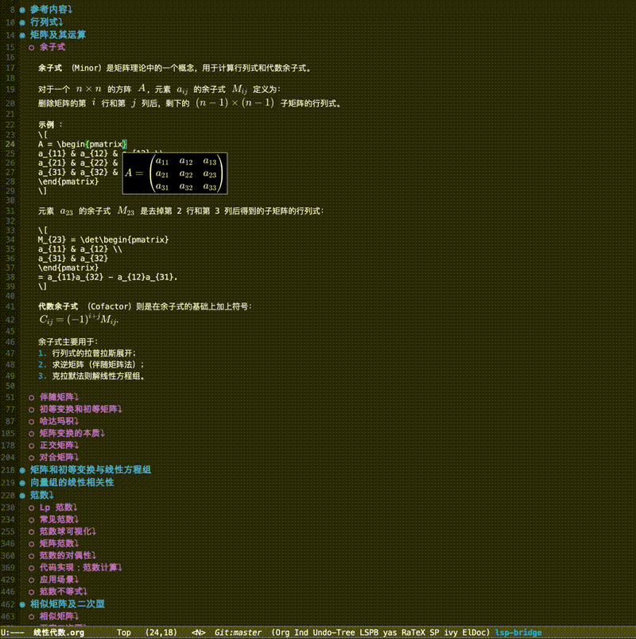

# ratex.el

[简体中文](./README.zh-CN.md)

`ratex.el` is an Emacs-focused inline math preview package built on top of the
upstream [RaTeX](https://github.com/erweixin/RaTeX) engine.

It is designed to render LaTeX math fragments inside Emacs with a small async
backend, SVG output, and minimal setup.

## Demo



## Features

- Async inline math preview inside Emacs
- SVG rendering backed by RaTeX
- Automatic backend build on first use
- Lightweight in-buffer rendering flow
- Works with `latex-mode`, `LaTeX-mode`, `org-mode`, and `markdown-mode`

## Repository Layout

- `vendor/ratex-core`: upstream RaTeX git submodule
- `backend/`: Rust backend process used by Emacs
- `lisp/`: Emacs Lisp package files
- `bin/`: helper scripts
- `test/`: Emacs-side tests
- `docs/`: project notes and plans

## Requirements

- Emacs 29.1 or newer
- Rust toolchain with `cargo`
- A checkout with submodules initialized

## Installation

Clone the repository with submodules:

```bash
git clone --recurse-submodules git@github.com:gongshangzheng/ratex.el.git
cd ratex.el
```

If you already cloned it without submodules:

```bash
git submodule update --init --recursive
```

## Emacs Setup

Add this repository to your `load-path`, then load `ratex`:

```elisp
(add-to-list 'load-path "/path/to/ratex.el/lisp")
(require 'ratex)
```

Enable it manually in the current buffer:

```elisp
M-x ratex-mode
```

Or enable it automatically for common text/math modes:

```elisp
(require 'ratex)
(ratex-setup)
```

Equivalent explicit hook setup:

```elisp
(add-hook 'latex-mode-hook #'ratex-mode)
(add-hook 'LaTeX-mode-hook #'ratex-mode)
(add-hook 'org-mode-hook #'ratex-mode)
(add-hook 'markdown-mode-hook #'ratex-mode)
```

## How It Works

When `ratex-mode` starts, it checks whether the backend binary exists at:

```text
backend/target/debug/ratex-editor-backend
```

If the binary is missing, or the backend sources are newer than the binary,
`ratex.el` automatically runs:

```bash
cargo build --manifest-path backend/Cargo.toml
```

After that, Emacs launches the compiled backend binary directly.

## Usage

The current interaction model is:

- when `ratex-mode` is enabled, formulas in the current buffer are rendered once
- when point enters a math fragment, preview is hidden
- while point stays inside that fragment, no continuous rendering is triggered
- when point leaves that fragment, only that fragment is rendered again

In other words, `ratex.el` avoids full refresh on every command and uses a
"render once on open + hide while editing + rerender on leave" flow.

Supported delimiters in the current prototype:

- `$...$`
- `$$...$$`
- `\(...\)`
- `\[...\]`

We recommend `\(...\)` and `\[...\]`. `$$...$$` may cause rendering issues in some cases.

These cases are skipped by default and will not be rendered:

- formulas inside code blocks (for example Org src/example/verbatim blocks and
  Markdown fenced code blocks)
- escaped delimiters (for example `\$`, `\\(`, `\\[`)

You can also trigger a full buffer refresh manually with:

```elisp
M-x ratex-refresh-previews
```

If needed, you can rebuild the backend manually with:

```elisp
M-x ratex-build-backend-command
```

## Example

In a LaTeX, Org, or Markdown buffer, place point inside:

```tex
$\frac{1}{2}$
```

or:

```tex
\[
\int_0^1 x^2\,dx
\]
```

`ratex.el` will ask the backend to render the fragment and show the SVG preview
through an overlay.

## Customization

Useful variables:

- `ratex-backend-root`: explicit repository root for backend discovery
- `ratex-font-size`: SVG font size sent to the backend
- `ratex-svg-padding`: SVG padding sent to the backend
- `ratex-render-color`: default formula color (for example `#e6e6e6`, `red`, `[RGB]178,34,34`)
- `ratex-edit-preview-posframe`: show preview in a posframe while editing
- `ratex-auto-build-backend`: whether to build automatically
- `ratex-backend-build-command`: build command
- `ratex-backend-binary`: backend binary path

Example:

```elisp
(setq ratex-backend-root "/path/to/ratex.el/")
(setq ratex-font-size 18.0)
(setq ratex-svg-padding 3.0)
(setq ratex-render-color "#4b5563")
(setq ratex-edit-preview-posframe t)
```

If backend auto-discovery still fails in your setup, set `ratex-backend-root`
explicitly. You can inspect the current detection result with:

```elisp
M-x ratex-diagnose-backend-command
```

## Manual Backend Development

You can still start the backend yourself during development:

```bash
bin/dev-start-backend.sh
```

## Current Status

This is an early prototype. The core rendering path is working, but the package
still needs more polish in areas such as:

- mode-aware math detection
- better stale-response handling
- richer user-facing error reporting
- packaging for MELPA or other package managers

## License

This repository currently contains original `ratex.el` integration code plus the
vendored upstream `vendor/ratex-core` submodule, which keeps its own upstream
license and history.
